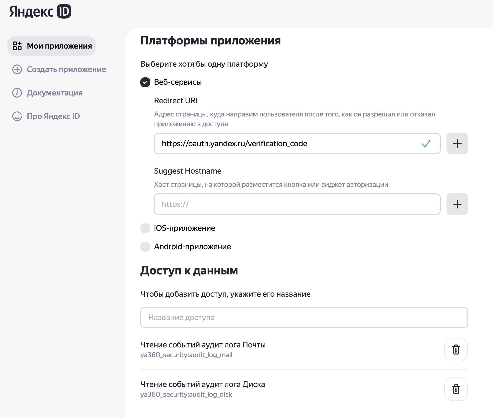

# Yandex 360 Audit Log Fetcher

## Overview

The `run_import.py` script is designed to fetch audit logs from the Yandex 360 API for mail and disk events, process them, and store them in local files organized by date. The script supports incremental updates by checking existing log files and downloading only new records since the last recorded date. It uses environment variables for configuration and includes robust logging for debugging and monitoring.

> [!WARNING]
> This version saves audit log records as JSON strings.

```
{"eventType": "message_receive", "date": "2025-04-23T04:59:35.118Z", "orgId": 7109800, "userUid": "11300000627297", "userLogin": "ivanov@domain.ru", "userName": "Иванов Сергей", "requestId": "", "uniqId": "166572375167335378", "source": "server", "mid": "1894326593262728", "folderName": "Inbox", "folderType": "inbox", "labels": [], "msgId": "<ilulvmxokjkijlnlno@calendar.yandex.ru>", "subject": "Сегодня, 23-го апреля, с 09:00 до 10:00 (Europe/Moscow, GMT+03:00), «Время на дорогу»", "from": "info@calendar.yandex.ru", "to": "", "cc": "", "bcc": "", "clientIp": "2a02:6b8:c37:bb43:0:4601:61:0"}
{"eventType": "message_receive", "date": "2025-04-23T05:00:03.381Z", "orgId": 7109800, "userUid": "11300000609567", "userLogin": "petrov@domain.ru", "userName": "Петрова Надежда", "requestId": "", "uniqId": "11169074286774709", "source": "server", "mid": "1894326593262748", "folderName": "Inbox", "folderType": "inbox", "labels": [], "msgId": "<f79b64a6-e104-4316-a89e-936feb3000@calendar.yandex.ru>", "subject": "Сегодня, 23-го апреля, просрочено 2 дела", "from": "info@calendar.yandex.ru", "to": "", "cc": "", "bcc": "", "clientIp": "2a02:6b8:c42:9a25:0:4601:2e:0"}
```

## Functionality

1. **Configuration Loading**:
   - Loads settings from environment variables (or a `.env` file) for API authentication, organization ID, file paths, and log file naming conventions.
   - Validates that all required parameters are set and directories exist.

2. **Log File Management**:
   - Checks for existing log files in the specified directories (`MAIL_LOG_CATALOG_LOCATION` and `DISK_LOG_CATALOG_LOCATION`).
   - Identifies the most recent log file and extracts the last recorded date to avoid duplicate downloads.

3. **Audit Log Retrieval**:
   - Fetches audit logs for mail and disk events from the Yandex 360 API (`https://api360.yandex.net`).
   - Supports pagination with a maximum of 20 pages (`MAIL_LOG_MAX_PAGES`).
   - Implements retry logic (up to 3 attempts with delays) for handling API request failures.
   - If a `last_date` is provided (from existing logs), fetches records after that date with a 2-minute overlap (`OVERLAPPED_MINITS`) to ensure no records are missed.

4. **Data Processing**:
   - Filters out duplicate records by comparing them with existing logs.
   - Organizes records by date (extracted from the `date` field in each record).
   - Writes records to files named in the format `<base_name>_<YYYY-MM-DD>.<extension>` (e.g., `mail_audit_2023-10-01.json`).

5. **Logging**:
   - Logs operations to both the console (INFO level) and a rotating log file (`get_audit_logs.log`, DEBUG level).
   - File rotation is based on size (1 MB max, 5 backups).

## Parameters

The script relies on the following environment variables, which can be set in a `.env` file located in the same directory as the script or directly in the environment:

| Parameter Name                  | Description                                                                 | Required | Example Value                     |
|---------------------------------|-----------------------------------------------------------------------------|----------|-----------------------------------|
| `OAUTH_TOKEN_ARG`               | OAuth token for authenticating with the Yandex 360 API.                     | Yes      | `y0_AgAAAA...`                   |
| `ORGANIZATION_ID_ARG`           | Organization ID for the Yandex 360 account (must be an integer).             | Yes      | `123456`                          |
| `MAIL_LOG_CATALOG_LOCATION`     | Directory path for storing mail audit log files.                            | Yes      | `/path/to/mail/logs`              |
| `DISK_LOG_CATALOG_LOCATION`     | Directory path for storing disk audit log files.                            | Yes      | `/path/to/disk/logs`              |
| `LOG_FILE_EXTENSION`            | File extension for log files.                                               | Yes      | `log`                             |
| `MAIL_LOG_FILE_BASE_NAME`       | Base name for mail audit log files (before date and extension).             | Yes      | `mail_audit`                      |
| `DISK_LOG_FILE_BASE_NAME`       | Base name for disk audit log files (before date and extension).             | Yes      | `disk_audit`                      |

### Notes on Parameters
- **Paths**: Ensure that `MAIL_LOG_CATALOG_LOCATION` and `DISK_LOG_CATALOG_LOCATION` point to existing directories. Trailing slashes (`/` or `\`) are automatically removed.
- **Validation**: The script validates that all parameters are set and that `ORGANIZATION_ID_ARG` is an integer. If any validation fails, the script logs an error and exits with code `1`.
- **.env File**: If a `.env` file exists in the script's directory, it is loaded automatically using `python-dotenv`. The `.env` file should follow the format:
  ```
  OAUTH_TOKEN_ARG=y0_AgAAAA...
  ORGANIZATION_ID_ARG=123456
  MAIL_LOG_CATALOG_LOCATION=/path/to/mail/logs
  DISK_LOG_CATALOG_LOCATION=/path/to/disk/logs
  LOG_FILE_EXTENSION=log
  MAIL_LOG_FILE_BASE_NAME=mail_audit
  DISK_LOG_FILE_BASE_NAME=disk_audit
  ```

## Setting up an OAuth application

1. To use the application, you need to generate an OAuth token for authentication in the Yandex 360 API. The token must contain the necessary rights to perform resource management operations in the Yandex 360 organization. Documentation - [Creating an application](https://yandex.ru/dev/id/doc/ru/register-client). The sequence of steps for creating a token:
* go to https://oauth.yandex.ru/client/new/. Authenticate on behalf of the Yandex 360 organization administrator.
* Fill in the fields in the application creation form:
- The "Name of your service" field - any name.
- Check the "Web services" box
- In the `Redirect URL` field, enter `https://oauth.yandex.ru/verification_code`
- In the "Contact email" section, specify your email.


* Add permissions for the token. To do this, in the "Data Access" section, find and add the following permissions:
| Permission name | What can you do |
|----------------|----------|
| ya360_security:audit_log_mail | read mail audit log records |
| ya360_security:audit_log_disk | read disk audit log records  |



* click the "Create Application" button.
* The properties of the created application are displayed in the new "My Applications" window. Find the section with the created application ID and copy the line from the "ClientID" field:


* In a text editor, create a line like `https://oauth.yandex.ru/authorize?response_type=token&client_id=<application ID>` and paste the copied ClientID value from the previous step instead of `<application ID>`.

Paste the resulting link into the browser and press "Enter".
* A request to confirm the token rights appears in the browser window. Confirmation **must be performed from the organization administrator account** (if this is done on behalf of a regular user, the token will not receive the requested rights due to the lack of necessary permissions for this user account).
Click "Login as" and receive the required access token.
> [!WARNING]
> Copy the token and save it in a safe place.

2. Get the organization ID in Yandex 360. To do this, go to the [administration console](admin.yandex.ru) and in the lower left corner of the interface there will be the required number.


3. Write the OAuth token and Org ID obtained in the previous step to the corresponding variables in the `.env` file in the same directory as the scripts themselves. This information is needed for correct authentication of scripts in the Yandex 360 API.
## Usage

1. **Set Up Environment**:
   - Create a `.env` file with the required parameters or set them as environment variables.
   - Ensure the specified directories exist and are writable.

2. **Run the Script**:
   ```bash
   python run_import.py
   ```
   - The script will:
     - Load settings and validate them.
     - Check for existing log files in the specified directories.
     - Fetch new audit logs for mail and disk events.
     - Write new records to date-based files (e.g., `mail_audit_2023-10-01.log`).

3. **Output**:
   - Log files are created or appended in the specified directories.
   - Console output provides INFO-level messages (e.g., number of records fetched, files written).
   - The `get_audit_logs.log` file contains detailed DEBUG-level logs.

## Dependencies

The script requires the following Python packages:
- `python-dotenv`: For loading environment variables from a `.env` file.
- `requests`: For making HTTP requests to the Yandex 360 API.
- `python-dateutil`: For date manipulation (e.g., `relativedelta`).

Install dependencies using:
```bash
pip install python-dotenv requests python-dateutil
```

## Logging

- **Console**: INFO-level logs with timestamps (e.g., `2023-10-01 12:00:00.123 INFO: Starting script...`).
- **File**: DEBUG-level logs written to `get_audit_logs.log`, rotated when the file reaches 1 MB (5 backup files kept).
- Log format: `%(asctime)s.%(msecs)03d %(levelname)s:\t%(message)s` with date format `YYYY-MM-DD HH:MM:SS`.

## Error Handling

- **Configuration Errors**: If any required environment variable is missing or invalid (e.g., `ORGANIZATION_ID_ARG` is not an integer), the script logs an error and exits with code `1`.
- **API Errors**: Handles HTTP errors with retries (up to 3 attempts, with increasing delays). If all retries fail, logs an error and returns an empty list.
- **General Exceptions**: Catches and logs exceptions with stack traces, exiting with code `1`.

## Example Workflow

1. **Initial Run**:
   - No existing log files → Fetches all available audit logs for mail and disk.
   - Creates files like `mail_audit_2023-10-01.log` and `disk_audit_2023-10-01.log`.

2. **Subsequent Runs**:
   - Finds the most recent log file (e.g., `mail_audit_2023-10-01.log`).
   - Extracts the last record’s date (e.g., `2023-10-01T12:00:00Z`).
   - Fetches new records from `2023-10-01T11:58:00Z` (2-minute overlap).
   - Appends new records to existing files or creates new ones for new dates.

## Limitations

- **Pagination**: Limited to 20 pages per API call cycle (`MAIL_LOG_MAX_PAGES`). Adjust this constant if more pages are needed.
- **Overlap**: Uses a 2-minute overlap (`OVERLAPPED_MINITS`) to avoid missing records. Modify if a different overlap is required.
- **Retries**: Limited to 3 retries (`MAX_RETRIES`) with a delay (`RETRIES_DELAY_SEC`). Adjust for different retry behavior.
- **Filtering**: Currently, no event or mailbox filtering is applied (`FILTERED_MAIL_EVENTS` and `FILTERED_MAILBOXES` are empty). Extend the code to support filtering if needed.

## Links to Yandex360 API

You can find all the necessary information on the structure of audit log records at [Security | Audit Log ](https://yandex.ru/dev/api360-preview/doc/ru/ref/AuditLogService/)

## Contributing

To contribute:
1. Fork the repository.
2. Create a feature branch (`git checkout -b feature-name`).
3. Commit changes (`git commit -m "Add feature"`).
4. Push to the branch (`git push origin feature-name`).
5. Open a pull request.

## License

This project is licensed under the MIT License. See the `LICENSE` file for details.