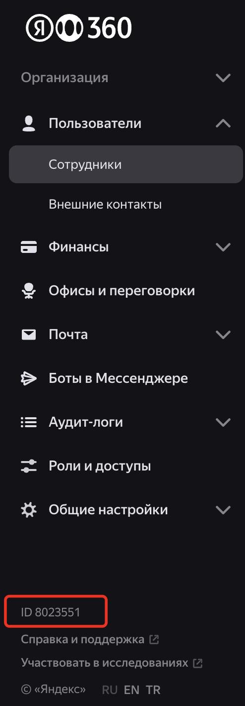

# Загрузка аудит-логов Yandex 360

Скрипт для автоматической загрузки и сохранения аудит-логов из Yandex 360 API в локальные файлы с организацией по датам.

## Описание

Данный проект предназначен для непрерывной загрузки аудит-логов из Yandex 360 через API и сохранения их в структурированном виде на локальном диске. Скрипт поддерживает работу с тремя типами логов: почта (mail), диск (disk) и общие логи (all), используя разные API endpoints и форматы данных.

> [!WARNING]
> Данная версия сохраняет записи аудит-логов в формате JSON строк.

## Примеры записей логов

### Логи почты (mail)
```json
{"eventType": "message_receive", "date": "2025-04-23T04:59:35.118Z", "orgId": 1234567, "userUid": "11300000620000", "userLogin": "ivanov@domain.ru", "userName": "Иванов Сергей", "requestId": "", "uniqId": "16657237516700000", "source": "server", "mid": "1894326593262728", "folderName": "Inbox", "folderType": "inbox", "labels": [], "msgId": "<ilulvmxokjkijlnlno@calendar.yandex.ru>", "subject": "Сегодня, 23-го апреля, с 09:00 до 10:00 (Europe/Moscow, GMT+03:00), «Время на дорогу»", "from": "info@calendar.yandex.ru", "to": "", "cc": "", "bcc": "", "clientIp": "2a02:6b8:c37:bb43:0:0000:61:0"}
```

### Логи диска (disk)
```json
{"eventType": "fs-mkdir", "date": "2025-06-10T08:05:23Z", "orgId": 1234567, "userUid": "113000000000000", "userLogin": "ivanov@domain.ru", "userName": "Иванов Сергей", "ownerUid": "1130000060000000", "ownerLogin": "ivanov@domain.ru", "ownerName": "Иванов Сергей", "resourceFileId": "869471618ff441ec6e533b97155f0d4db91895f177fc6fa9866d3db00000000", "path": "/disk/Общая папка ", "size": "0", "lastModificationDate": "2025-06-10T08:05:23Z", "rights": "", "requestId": "web-1749542723687610-1102389625172600000-disk-web-client-stable-client-18", "uniqId": "5379628844452860000", "clientIp": "175.100.115.192"}
```

### Общие логи нового формата (all)
```json
{"event": {"idempotency_id": "7c2fc705-65a0-441c-8755-b0d4bdea0000", "ip": "185.228.115.205", "is_system": false, "meta": {"conference_id": "6217840000", "live_stream_id": "f5cbb54de85a4c7a98e218ae72ae0000", "conference_start": null, "user_app_version": null}, "occurred_at": "2025-09-04T07:23:15.173000+00:00", "org_id": 1234567, "request_id": "rest-187ba7db947d8c66fe66e1062000000-disk-api-stable-intapi-telemost-27", "service": "Web", "status": "Success", "type": "telemost_conference.live_stream.viewer.joined", "uid": 1941123456}, "user_login": "ivanov", "user_name": "Иванов Сергей"}
```

## Функциональность

### 1. Загрузка конфигурации
- Загружает настройки из переменных окружения (или файла `.env`) для аутентификации API, ID организации, путей к файлам и соглашений об именовании файлов логов
- Проверяет, что все необходимые параметры установлены и каталоги существуют
- Поддерживает настройку часового пояса через `TIMEZONE_SHIFT_IN_HOURS`

### 2. Управление файлами логов
- Проверяет существующие файлы логов в указанных каталогах для каждого типа логов
- Определяет самый последний файл лога и извлекает дату последней записи для избежания дублирования загрузок
- Поддерживает инкрементальное обновление на основе временных меток
- Кэширует последние обработанные записи в памяти для оптимизации

### 3. Получение аудит-логов

#### Логи почты и диска (старый формат)
- Использует API endpoint `https://api360.yandex.net/security/v1/org/{org_id}/audit_log/{mail|disk}`
- Поддерживает пагинацию с ограничением `OLD_LOG_MAX_PAGES = 10` страниц за цикл
- Обрабатывает временные циклы по `OLD_LOG_ONE_FETCH_CYCLE_IN_MINUTES = 180` минут
- Использует перекрытие в `OVERLAPPED_SECONDS = 2` секунды для избежания потери записей

#### Общие логи (новый формат)
- Использует новый API endpoint `https://cloud-api.yandex.net/v1/auditlog/organizations/{org_id}/events`
- Обрабатывает временные циклы по `NEW_LOG_ONE_FETCH_CYCLE_IN_MINUTES = 180` минут
- Поддерживает автоматическую пагинацию через `iteration_key`
- Максимум `ALL_LOGS_MAX_RECORDS = 100` записей за запрос

### 4. Обработка данных
- Фильтрует дублирующиеся записи путем сравнения с кэшированными последними записями
- Организует записи по датам (извлеченным из поля даты в каждой записи)
- Записывает записи в файлы с именами в формате `<базовое_имя>_<ГГГГ-ММ-ДД>.<расширение>`
- Сортирует записи по времени внутри каждого файла

### 5. Планировщик загрузки
- Функция `download_scheduler()` обеспечивает непрерывную работу скрипта
- Циклически обрабатывает все три типа логов: mail, disk, all
- Автоматически определяет последние обработанные записи для каждого типа логов
- Поддерживает настраиваемые интервалы сна `SLEEP_MINITS_AFTER_LAST_FETCH = 10` минут между циклами

### 6. Обработка ошибок и повторные попытки
- Реализует логику повторных попыток (до `MAX_RETRIES = 3` попыток с задержками `RETRIES_DELAY_SEC = 2` секунды)
- Логирует детальную информацию об ошибках включая X-Request-Id для отладки
- Graceful handling прерывания через Ctrl+C

### 7. Логирование
- Ведет журнал операций как в консоль (уровень INFO), так и в ротируемый файл лога `get_audit_logs.log` (уровень DEBUG)
- Ротация файлов основана на размере (максимум 1 МБ, 5 резервных копий)
- Подробное логирование всех операций с временными метками

## Установка и настройка

### 1. Создание виртуального окружения Python

#### Для macOS:
```bash
# Создание виртуального окружения
python3 -m venv virtenv

# Активация виртуального окружения
source virtenv/bin/activate

# Установка зависимостей
pip install -r requirements.txt
```

#### Для Windows:
```cmd
# Создание виртуального окружения
python -m venv virtenv

# Активация виртуального окружения
virtenv\Scripts\activate

# Установка зависимостей
pip install -r requirements.txt
```

### 2. Параметры конфигурации

Скрипт использует следующие переменные окружения, которые можно установить в файле `.env`:

| Имя параметра | Описание | Обязательный | Пример значения |
|---------------|----------|--------------|-----------------|
| `OAUTH_TOKEN_ARG` | OAuth токен для аутентификации в Yandex 360 API | Да | `y0_AgAAAA...` |
| `ORGANIZATION_ID_ARG` | ID организации для аккаунта Yandex 360 (должен быть целым числом) | Да | `1234567` |
| `MAIL_LOG_CATALOG_LOCATION` | Путь к каталогу для хранения файлов аудит-логов почты | Да | `./mail` |
| `DISK_LOG_CATALOG_LOCATION` | Путь к каталогу для хранения файлов аудит-логов диска | Да | `./disk` |
| `NEW_LOG_CATALOG_LOCATION` | Путь к каталогу для хранения файлов общих аудит-логов | Да | `./y360` |
| `LOG_FILE_EXTENSION` | Расширение файлов логов | Да | `json` |
| `MAIL_LOG_FILE_BASE_NAME` | Базовое имя для файлов аудит-логов почты | Да | `mail_audit` |
| `DISK_LOG_FILE_BASE_NAME` | Базовое имя для файлов аудит-логов диска | Да | `disk_audit` |
| `NEW_LOG_FILE_BASE_NAME` | Базовое имя для файлов общих аудит-логов | Да | `y360_audit` |
| `TIMEZONE_SHIFT_IN_HOURS` | Смещение часового пояса в часах (от -12 до +12) | Да | `3` |

### Примечания по параметрам
- **Пути**: Убедитесь, что каталоги существуют и доступны для записи
- **Валидация**: Скрипт проверяет, что все параметры установлены и корректны
- **Часовой пояс**: Используется для корректного расчета временных интервалов
- **Файл .env**: Пример содержимого файла `.env`:
  ```
  OAUTH_TOKEN_ARG = "y0_AgAAAA..."
  ORGANIZATION_ID_ARG = 1234567
  MAIL_LOG_CATALOG_LOCATION = "./mail"
  DISK_LOG_CATALOG_LOCATION = "./disk"
  NEW_LOG_CATALOG_LOCATION = "./y360"
  LOG_FILE_EXTENSION = "json"
  MAIL_LOG_FILE_BASE_NAME = "mail_audit"
  DISK_LOG_FILE_BASE_NAME = "disk_audit"
  NEW_LOG_FILE_BASE_NAME = "y360_audit"
  TIMEZONE_SHIFT_IN_HOURS = 3
  ```

## Настройка OAuth приложения

1. Для использования приложения необходимо сгенерировать OAuth токен для аутентификации в Yandex 360 API. Токен должен содержать необходимые права для выполнения операций управления ресурсами в организации Yandex 360. Документация - [Создание приложения](https://yandex.ru/dev/id/doc/ru/register-client).

Последовательность шагов для создания токена:
* перейдите на https://oauth.yandex.ru/client/new/. Аутентифицируйтесь от имени администратора организации Yandex 360
* В предлагаемом окне выберите "Для доступа к API или отладке" и нажмите "Перейти к созданию".


* заполните поля в форме создания приложения:
  - поле "Название вашего сервиса" - любое название
  - проверьте почту для связи

* добавьте разрешения для токена. Для этого в разделе "Доступ к данным" найдите и добавьте следующие разрешения:

| Название разрешения | Что можно делать |
|-------------------|------------------|
| ya360_security:audit_log_mail | читать записи аудит-лога почты |
| ya360_security:audit_log_disk | читать записи аудит-лога диска |
| ya360_security:read_auditlog  | читать записи аудит лога нового формата


* нажмите кнопку "Создать приложение"
* закройте окно с предложением пройти верификацию через Госуслуги
* в новом окне "Мои приложения" отображаются свойства созданного приложения. Найдите раздел с ID созданного приложения и скопируйте строку из поля "ClientID":


* в текстовом редакторе создайте строку вида `https://oauth.yandex.ru/authorize?response_type=token&client_id=<ID приложения>` и вставьте скопированное значение ClientID из предыдущего шага вместо `<ID приложения>`

Вставьте получившуюся ссылку в браузер и нажмите "Enter".
* в окне браузера появляется запрос на подтверждение прав токена. Подтверждение **должно выполняться с аккаунта администратора организации** (если это сделать от имени обычного пользователя, токен не получит запрашиваемые права из-за отсутствия необходимых разрешений у данного пользовательского аккаунта).
Нажмите "Войти как" и получите необходимый токен доступа.

> [!WARNING]
> Скопируйте токен и сохраните его в безопасном месте.

2. Получите ID организации в Yandex 360. Для этого перейдите в [консоль администрирования](admin.yandex.ru) и в левом нижнем углу интерфейса будет необходимый номер.



3. Запишите полученные на предыдущем шаге OAuth токен и Org ID в соответствующие переменные в файле `.env` в том же каталоге, что и сами скрипты.

## Использование

### 1. Настройка окружения:
- Создайте и активируйте виртуальное окружение Python (см. инструкции выше)
- Создайте файл `.env` с необходимыми параметрами
- Убедитесь, что указанные каталоги существуют и доступны для записи
- Установите зависимости: `pip install -r requirements.txt`

### 2. Запуск скрипта:
```bash
python run_import.py
```

Скрипт выполнит:
- Загрузку и валидацию настроек
- Вывод текущих констант конфигурации
- Запуск планировщика для непрерывной загрузки логов
- Циклическую обработку всех трех типов логов

### 3. Остановка скрипта:
- Используйте `Ctrl+C` для корректного завершения работы
- Скрипт завершит текущий цикл и сохранит состояние

### 4. Результат работы:
- Файлы логов создаются или дополняются в указанных каталогах
- Вывод в консоль предоставляет сообщения уровня INFO
- Файл `get_audit_logs.log` содержит подробные логи уровня DEBUG

## Архитектура скрипта

### Основные функции:

1. **`main()`** - точка входа в программу, инициализация и запуск планировщика
2. **`get_settings()`** - загрузка и валидация конфигурации из переменных окружения
3. **`download_scheduler()`** - основной планировщик для непрерывной работы
4. **`get_date_of_last_record()`** - определение даты последней обработанной записи для каждого типа логов

#### Для старых логов (mail, disk):
5. **`fetch_and_save_old_logs_controller()`** - контроллер для загрузки старых логов в циклическом режиме
6. **`fetch_mail_audit_logs()`** - загрузка аудит-логов почты
7. **`fetch_disk_audit_logs()`** - загрузка аудит-логов диска
8. **`save_old_logs_to_file()`** - сохранение старых логов в файлы, организованные по датам

#### Для новых логов (all):
9. **`fetch_and_save_new_logs_controller()`** - контроллер для загрузки новых логов в циклическом режиме
10. **`fetch_all_audit_logs_by_params()`** - загрузка общих аудит-логов с параметрами
11. **`save_new_logs_to_file()`** - сохранение новых логов в файлы, организованные по датам

### Константы конфигурации:
- `NEW_LOG_ONE_FETCH_CYCLE_IN_MINUTES = 180` - время в минутах для одного цикла загрузки новых логов
- `OLD_LOG_ONE_FETCH_CYCLE_IN_MINUTES = 180` - время в минутах для одного цикла загрузки старых логов
- `MAX_DAYS_AGO_FOR_API_CALLS = 90` - максимальное количество дней в прошлое для API вызовов
- `SLEEP_MINITS_AFTER_LAST_FETCH = 10` - время сна после полного цикла загрузки всех типов логов
- `OLD_LOG_MAX_PAGES = 10` - максимальное количество страниц для старых логов за один цикл
- `OVERLAPPED_SECONDS = 2` - перекрытие в секундах для избежания потери записей
- `ALL_LOGS_MAX_RECORDS = 100` - максимальное количество записей за один запрос для новых логов

### Структуры данных:
- **`SettingParams`** - dataclass для хранения настроек конфигурации
- **`RuntimeData`** - dataclass для хранения состояния выполнения (последние обработанные записи)

## Зависимости

Скрипт требует следующие Python пакеты:
- `python-dotenv`: для загрузки переменных окружения из файла `.env`
- `requests`: для выполнения HTTP запросов к Yandex 360 API
- `python-dateutil`: для манипуляций с датами

Установка зависимостей:
```bash
pip install -r requirements.txt
```

## Логирование

- **Консоль**: логи уровня INFO с временными метками и миллисекундами
- **Файл**: логи уровня DEBUG записываются в `get_audit_logs.log` с ротацией при достижении 1 МБ (5 резервных копий)
- Формат логов: `YYYY-MM-DD HH:MM:SS.mmm LEVEL: сообщение`
- Подробное логирование включает X-Request-Id для отладки API запросов

## Обработка ошибок

- **Ошибки конфигурации**: при отсутствии обязательных переменных окружения скрипт завершается с кодом `1`
- **Ошибки API**: обрабатываются с повторными попытками (до 3 попыток с увеличивающимися задержками)
- **Ошибки файловой системы**: логируются с полной трассировкой стека
- **Прерывание пользователем**: корректная обработка Ctrl+C с сохранением состояния

## Особенности работы

### Типы логов:
1. **Mail logs** - логи почтовых событий (старый API)
2. **Disk logs** - логи событий диска (старый API)  
3. **All logs** - общие логи всех событий (новый API)

### Временные зоны:
- Скрипт учитывает настройку часового пояса через `TIMEZONE_SHIFT_IN_HOURS`
- Все временные расчеты корректируются на указанное смещение

### Дедупликация:
- Записи сравниваются с кэшированными последними записями для избежания дублирования
- Поддерживается обработка записей с одинаковыми временными метками

## Ссылки на Yandex 360 API

Всю необходимую информацию о структуре записей аудит-логов можно найти в документации:
- [Security | Audit Log](https://yandex.ru/dev/api360-preview/doc/ru/ref/AuditLogService/) - старый API для mail/disk логов
- [Cloud API | Audit Log](https://yandex.ru/dev/api360-preview/doc/ru/ref/AuditLogService/) - новый API для общих логов

## Лицензия

Этот проект лицензирован под лицензией MIT. См. файл `LICENSE` для подробностей.